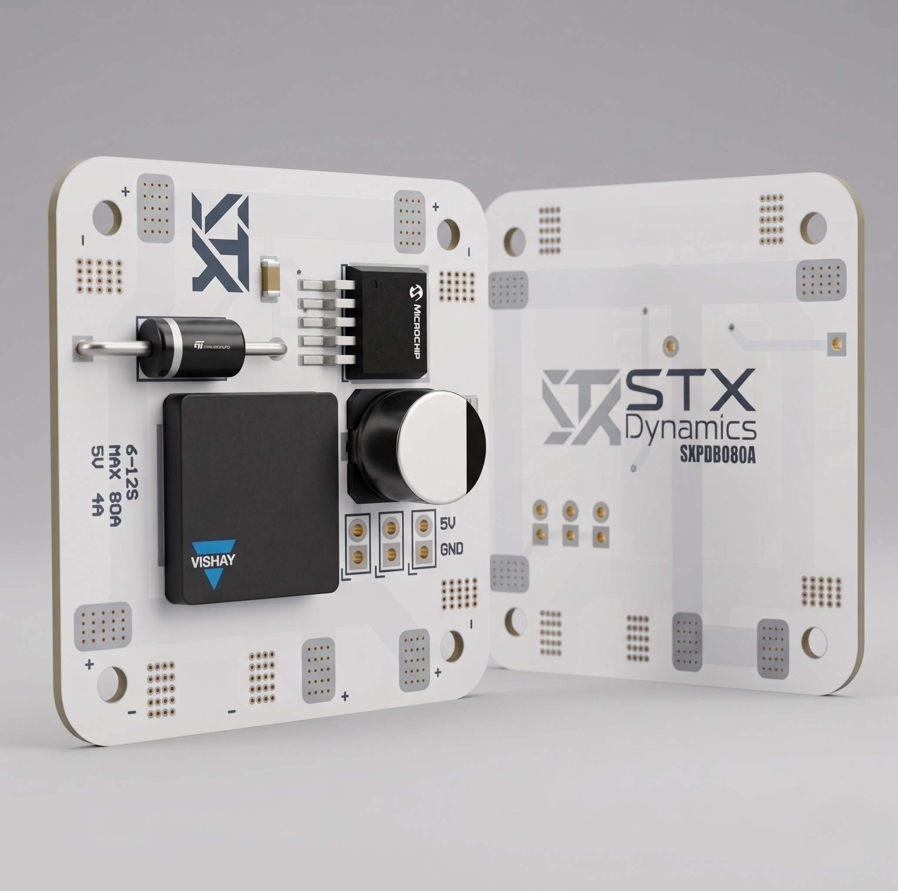

<div align="center">

# STX Dynamics — High-Current Power Distribution Board

**Model:** STX-PDB-80-R1 · **Part No:** `SXPDB080A`

A compact, high-current power distribution board (PDB) for 6S–12S multirotor and high-power RC platforms, with an integrated 5 V / 4 A regulated output.

<!-- Replace the badge values below once you've set up the repo / releases / license -->


</div>



---

## Overview

The **STX-PDB-80** distributes battery power to multiple speed controllers (ESCs) from a single high-current input, while supplying a clean, regulated **5 V / 4 A** rail for flight controllers, receivers, and other low-voltage peripherals.

It is built around an integrated step-down regulator and high-current copper distribution, with input protection and bulk filtering for stable operation under load. The board targets **6S–12S** systems and a continuous current of up to **80 A**.


---

## Key Features

- **Wide input range** — supports 6S to 12S battery packs
- **High current capacity** — up to 80 A continuous distribution
- **Integrated 5 V / 4 A BEC** — powers flight controllers, receivers, and peripherals directly
- **Onboard input protection** — series rectifier diode for reverse/transient protection
- **Bulk capacitance** — electrolytic input/output filtering for voltage stability under load
- **Compact square form factor** with corner mounting points
- **Clearly labelled outputs** — dedicated `5V` and `GND` pads

---

## Specifications

| Parameter | Value |
|---|---|
| Battery input | 6S – 12S LiPo |
| Input voltage (nominal) | ≈ 22.2 V – 44.4 V |
| Input voltage (max, fully charged) | ≈ 50.4 V |
| Max continuous current | 80 A |
| Regulated output (BEC) | 5 V @ 4 A |
| Onboard regulator | Step-down (buck) — Microchip |
| Input protection | Series rectifier diode — STMicroelectronics |
| Power inductor | Vishay (IHLP-series style) |
| Bulk capacitor | Aluminium electrolytic |
| Dimensions (L × W) | **50x50** mm |
| Mounting pattern | **M3** (corner holes) |
| Weight | **12** g |
| Operating temperature | **90** |

> Voltage figures are derived from cell count (3.7 V nominal / 4.2 V max per cell). Confirm against your validated test data before publishing.

---

## Board Layout & Connections

| Marking | Function |
|---|---|
| `5V` | Regulated 5 V output |
| `GND` | Ground / return |
| Corner pads | High-current ESC / power solder pads |
| Center pads | Input / distribution **(confirm in your layout)** |

**Top side** carries the active components (regulator, diode, inductor, bulk capacitor) and the `5V` / `GND` output header. **Bottom side** carries the STX Dynamics branding and the etched part number `SXPDB080A`.

<!-- TODO: add an annotated board photo or pinout diagram here, e.g. -->
<!--  -->

---

## Bill of Materials (key components)

| Ref | Component | Manufacturer | Part No. |
|---|---|---|---|
| D1 | Rectifier diode | STMicroelectronics | **-** |
| U1 | Step-down regulator | Microchip | **-** |
| L1 | Power inductor | Vishay | **-** |
| C1 | Bulk electrolytic capacitor | **-** | **-** |

> Identified from package markings/logos on the board. Add exact part numbers and any passives from your design files. A full BOM (`BOM.csv`) is recommended in the repo root or `/hardware`.

---

## Getting Started

> ⚠️ **Always disconnect the battery before soldering or modifying connections.**

1. **Mount** the board to your frame using the four corner mounting points, ensuring no exposed pads contact the frame or other conductive surfaces.
2. **Solder the battery input** leads to the designated input pads, observing correct polarity.
3. **Solder each ESC** power lead to the corner distribution pads, keeping leads short and balanced.
4. **Connect peripherals** (flight controller, receiver) to the `5V` / `GND` output, confirming the 5 V rail with a multimeter before connecting sensitive electronics.
5. **Verify** all joints for shorts and cold solder before applying power.

### Operating Notes

- Keep total continuous draw within the **80 A** rating; size your wiring accordingly.
- The **5 V / 4 A** rail is shared across all peripherals connected to it — budget your current accordingly.
- Ensure adequate airflow around the regulator under sustained high load.

---

## Product Numbering

STX Dynamics products use a dual identifier: a **human-readable** code and a **compact** code etched on the hardware. Both encode the same fields.

| Field | Readable | Compact |
|---|---|---|
| Company | `STX` | `SX` |
| Family | `PDB` | `PDB` |
| Max current (A) | `80` | `080` |
| Revision | `R1` | `A` |

**This product:** `STX-PDB-80-R1` ⇄ `SXPDB080A`

Compact format: `SX` + family token + 3-digit current + revision letter (`A` = R1, `B` = R2, …).

---

## Repository Structure

```
.
├── README.md            # This file
├── LICENSE              # TODO: choose a license
├── CHANGELOG.md         # Revision history
├── hardware/            # Schematics, board files, gerbers
│   ├── schematic.pdf
│   └── BOM.csv
└── docs/
    └── images/          # Board photos, pinout, diagrams
```

<!-- Adjust to match how you actually organize the repo. Remove this section if it's a documentation-only repo. -->

---

## Documentation

- 📄 Datasheet — **-**
- 🔌 Wiring guide — **-**
- 🛠️ Assembly guide — **-**

---

## Revision History

| Revision | Part No. | Date | Notes |
|---|---|---|---|
| R1 | `SXPDB080A` | **2024** | Initial release |

---

## Contributing

Issues and pull requests are welcome. For hardware change requests, please open an issue describing the proposed change and the use case.

<!-- If this is not an open-hardware project, replace this section with support/RMA contact instructions instead. -->

---

## License


---

## Support & Contact

- **Company:** STX Dynamics
- **Email:** **stuncdemir0@gmail.com**
- **Website:** **stxdynamics.com**

---

<div align="center">

© STX Dynamics. All rights reserved.

</div>
